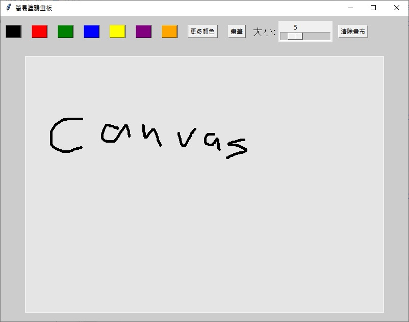

# Simple Doodle Canvas 

一個用 **Tkinter** 製作的簡易塗鴉畫板，支援顏色挑選、畫筆大小、橡皮擦與清除畫布。

##  功能特色
-  畫筆：支援多色、可調粗細
-  橡皮擦：一鍵切換，快速修改
-  連續筆觸：圓角線段、平滑繪製
-  自訂顏色：系統色盤選色
-  清除畫布：一鍵全清

##  使用方式

python main.py

## 使用範例



## 目錄結構

```
.
├── main.py       # 主程式
├── README.md
├── LICENSE
└── .gitignore
```

## 授權

MIT License
